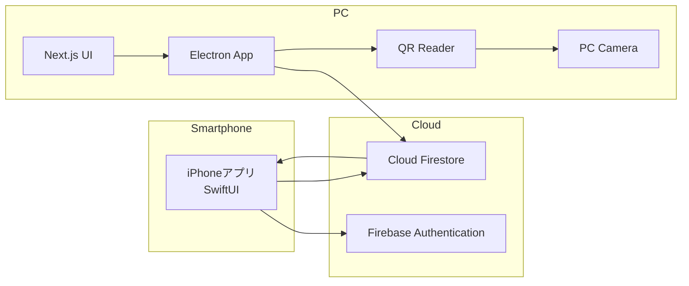
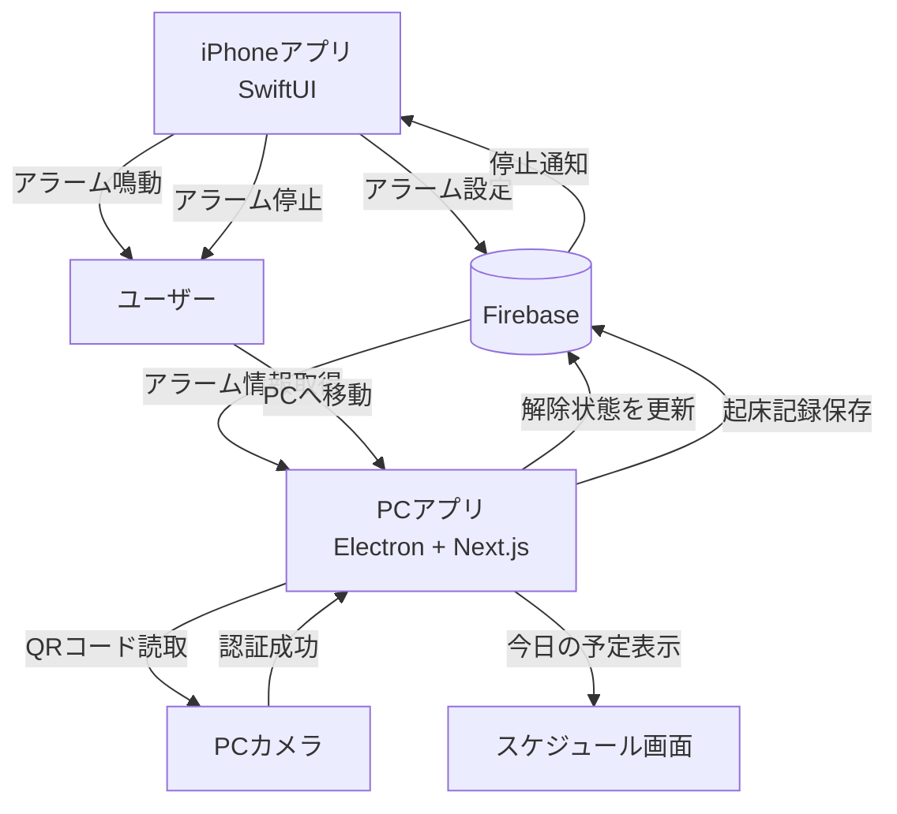
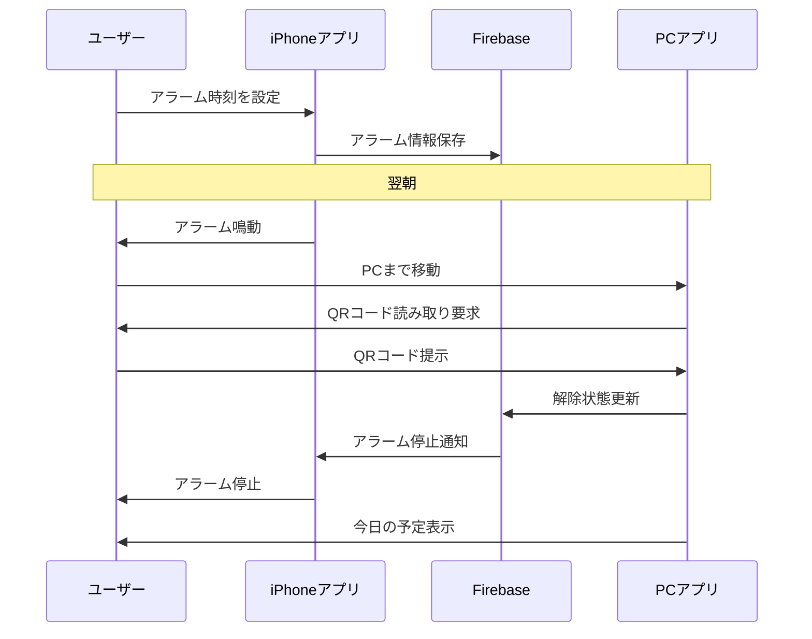

# sawanoHackTeam1

## 概要

QRコードを読み取るまでアラームを停止できないことで、ユーザーを物理的に移動させて確実な起床を促すシステム。

スマートフォンを手元に置いたままアラームを停止し、二度寝してしまう問題を解決することを目的とする。

---

# 設計決定（Issue #3 で合意）

実装前にチームで合意した論点と決定事項。詳細は [Issue #3](https://github.com/shuta1123/sawanoHackTeam1/issues/3) を参照。

| # | 論点 | 決定 |
|---|------|------|
| 1 | iPhoneのアラーム実現方式 | **AlarmKit（iOS 26+）** を採用。デモ端末を iOS 26 以上に固定する |
| 2 | フェイルセーフ | **自動停止＋緊急停止の併用**。最大 10 分鳴動で自動停止し当日は `failed` 記録／アプリ内のパスワード入力でも解除可能（同じく `failed`） |
| 3 | QRコードの方式 | **iPhone画面に表示したQRをPCカメラへ提示**する。仕様書の「設置」表現は「提示」に統一。QRには `userId` をエンコード |
| 4 | alarms の状態遷移 | 状態遷移は `scheduled → ringing → dismissed`（タイムアウト時は `→ failed`）。**status は時刻から導出**し、`dismissed` は QR 読取成功時に PC が書き込む |
| 5 | 「今日の予定表示」の扱い | **MVP に含める**（まずはハードコードした予定リストの表示）。Google/Apple カレンダー連携のみ発展機能に残す |
| 6 | PCアプリの稼働前提 | 就寝中の常時起動は前提とせず、**朝起きたタイミングでユーザーが PC を起動**して QR を読み取る運用とする |

---

# 解決したい課題

## 現状の問題

* スマートフォンを手元に置いたままアラームを停止できる
* スヌーズを繰り返して二度寝してしまう
* 起きても布団から出る動機が弱い

## 解決策

* QRコードを読み取るまでアラームを停止できない
* PC本体をベッドから離れた場所に置き、起床後にPCまで移動させる
* PCカメラでiPhone画面のQRコードを読み取らせ、強制的に立ち上がらせて移動させる

---

# システム構成図

## 全体アーキテクチャ



---

## システム動作概要



---

# シーケンス図



---

# ユーザーフロー

## 夜

1. iPhoneアプリでアラーム時刻を設定
2. Firebaseへアラーム情報を保存
3. 就寝

## 朝

1. iPhoneでアラームが鳴動
2. ユーザーが起床
3. PCまで移動
4. PCカメラでQRコードを読み取る
5. Firebaseへ解除状態を送信
6. iPhoneのアラームを停止
7. 今日の予定を表示

---

# 機能一覧

## MVP（最低限実装）

### iPhoneアプリ

* アラーム設定
* AlarmKit によるアラーム鳴動（iOS 26+）
* QRコード表示（`userId` をエンコード）
* 緊急停止（パスワード入力 → `failed` 記録）
* 最大10分での自動停止（→ `failed` 記録）
* Firebase連携

### PCアプリ

* QRコード読取（PCカメラ）
* アラーム解除（`dismissed` 書き込み）
* 起床履歴表示
* 今日の予定表示（ハードコードでも可）

### Firebase

* 認証
* データ保存
* 状態同期

---

## 発展機能

### ストリーク機能

連続で目標時刻内に起床できた日数を表示する。

例

```text
🔥 5日連続成功
🔥 12日連続成功
```

### カレンダー連携

起床後に表示する「今日の予定」を外部カレンダーから取得する（MVPではハードコード）。

* Google Calendar連携
* Apple Calendar連携

---

# 技術スタック

## iPhone

### フレームワーク

* SwiftUI

### 主な役割

* アラーム設定
* アラーム鳴動
* Firebaseとの通信

---

## PC

### フレームワーク

* Electron
* Next.js
* TypeScript

### 主な役割

* QRコード読取
* 起床履歴表示
* ストリーク表示
* スケジュール表示

---

## バックエンド

### Firebase Authentication

ユーザー認証

### Cloud Firestore

データ保存

### Firebase Cloud Messaging（必要に応じて）

通知連携

---

# データ構造例

MVP では「1ユーザー1アラーム」に割り切り、`alarms` のドキュメントID = `userId` とする。

## alarms

```json
{
  "time": "06:30",
  "repeatDays": ["mon", "tue", "wed", "thu", "fri"],
  "status": "scheduled",
  "dismissedAt": null,
  "updatedAt": "2026-06-13T22:00:00.000Z"
}
```

`status` の取りうる値と遷移:

```text
scheduled → ringing → dismissed
                   ↘ failed（最大鳴動時間タイムアウト／緊急停止）
```

* `status` は基本的に時刻から導出する（現在時刻 >= `time` かつ未解除なら鳴動中とみなす）
* `dismissed` への更新は QR 読取成功時に PC が書き込む
* `dismissedAt` は解除時刻（ISO 8601）

## wakeLogs

```json
{
  "userId": "user001",
  "date": "2026-06-09",
  "wakeTime": "06:33",
  "success": true
}
```

---

# チーム開発における役割分担

## フロントエンド（iPhone）

* SwiftUI画面作成
* アラーム機能実装
* Firebase連携

## フロントエンド（PC）

* Next.js画面作成
* QRコード読取機能
* ダッシュボード実装

## バックエンド

* Firestore設計
* Authentication設定
* データ管理

---

# 差別化ポイント

既存の目覚ましアプリ

* スヌーズ
* 計算問題
* 端末を振る

本システム

* 実際に移動しなければ停止できない
* QRコードによる物理的な行動を要求
* 起床習慣の形成を支援
* 起床後すぐに予定を確認できる

---

# 最終構成

```text
iPhone (SwiftUI)
        ↓
     Firebase
        ↓
PC (Electron + Next.js)
```

Bluetoothによる距離判定機能は実装対象外とし、

「アラーム → PCへ移動 → QRコード読取 → アラーム停止」

というコア機能の実現を最優先とする。

## 運用前提

* デモ端末は iOS 26 以上に固定する（AlarmKit 利用のため）
* 就寝中の PC 常時起動は前提としない。朝起きたタイミングでユーザーが PC を起動して QR を読み取る
* PC はベッドから離れた場所に設置する（強制移動の担保）
