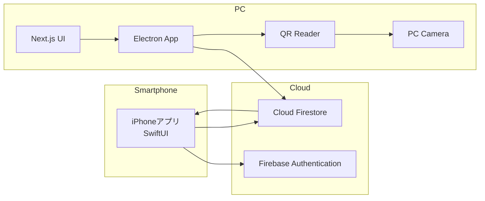
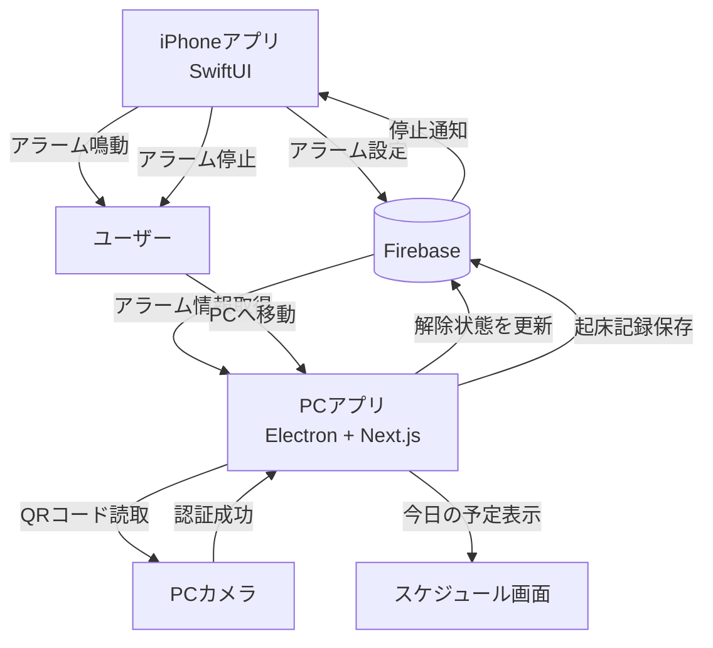
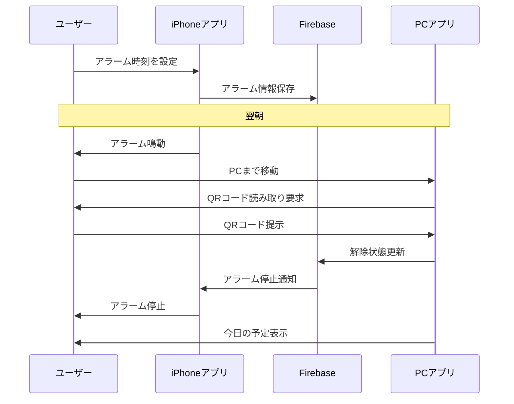

# sawanoHackTeam1

## 概要

QRコードを読み取るまでアラームを停止できないことで、ユーザーを物理的に移動させて確実な起床を促すシステム。

スマートフォンを手元に置いたままアラームを停止し、二度寝してしまう問題を解決することを目的とする。

---

# 解決したい課題

## 現状の問題

* スマートフォンを手元に置いたままアラームを停止できる
* スヌーズを繰り返して二度寝してしまう
* 起きても布団から出る動機が弱い

## 解決策

* QRコードを読み取るまでアラームを停止できない
* QRコードを離れた場所に設置する
* ユーザーを強制的に立ち上がらせて移動させる

---

# システム構成図

## 全体アーキテクチャ



---

## システム動作概要



---

# シーケンス図



---

# ユーザーフロー

## 夜

1. iPhoneアプリでアラーム時刻を設定
2. Firebaseへアラーム情報を保存
3. 就寝

## 朝

1. iPhoneでアラームが鳴動
2. ユーザーが起床
3. PCまで移動
4. PCカメラでQRコードを読み取る
5. Firebaseへ解除状態を送信
6. iPhoneのアラームを停止
7. 今日の予定を表示

---

# 機能一覧

## MVP（最低限実装）

### iPhoneアプリ

* アラーム設定
* アラーム鳴動
* Firebase連携

### PCアプリ

* QRコード読取
* アラーム解除
* 起床履歴表示

### Firebase

* 認証
* データ保存
* 状態同期

---

## 発展機能

### ストリーク機能

連続で目標時刻内に起床できた日数を表示する。

例

```text
🔥 5日連続成功
🔥 12日連続成功
```

### スケジュール表示

起床後に本日の予定を表示する。

例

```text
09:00 講義
13:00 昼食
15:00 アルバイト
```

### カレンダー連携

* Google Calendar連携
* Apple Calendar連携

---

# 技術スタック

## iPhone

### フレームワーク

* SwiftUI

### 主な役割

* アラーム設定
* アラーム鳴動
* Firebaseとの通信

---

## PC

### フレームワーク

* Electron
* Next.js
* TypeScript

### 主な役割

* QRコード読取
* 起床履歴表示
* ストリーク表示
* スケジュール表示

---

## バックエンド

### Firebase Authentication

ユーザー認証

### Cloud Firestore

データ保存

### Firebase Cloud Messaging（必要に応じて）

通知連携

---

# データ構造例

## alarms

```json
{
  "userId": "user001",
  "time": "06:30",
  "status": "ringing"
}
```

## wakeLogs

```json
{
  "userId": "user001",
  "date": "2026-06-09",
  "wakeTime": "06:33",
  "success": true
}
```

---

# チーム開発における役割分担

## フロントエンド（iPhone）

* SwiftUI画面作成
* アラーム機能実装
* Firebase連携

## フロントエンド（PC）

* Next.js画面作成
* QRコード読取機能
* ダッシュボード実装

## バックエンド

* Firestore設計
* Authentication設定
* データ管理

---

# 差別化ポイント

既存の目覚ましアプリ

* スヌーズ
* 計算問題
* 端末を振る

本システム

* 実際に移動しなければ停止できない
* QRコードによる物理的な行動を要求
* 起床習慣の形成を支援
* 起床後すぐに予定を確認できる

---

# 最終構成

```text
iPhone (SwiftUI)
        ↓
     Firebase
        ↓
PC (Electron + Next.js)
```

Bluetoothによる距離判定機能は実装対象外とし、

「アラーム → PCへ移動 → QRコード読取 → アラーム停止」

というコア機能の実現を最優先とする。
